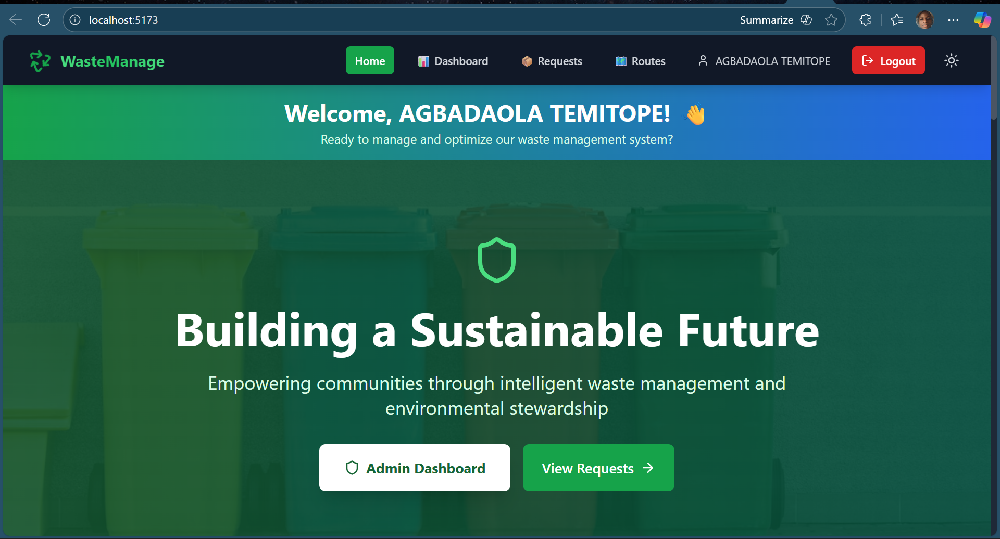
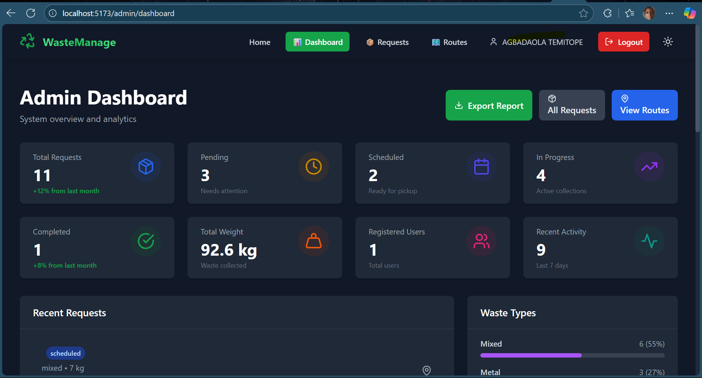
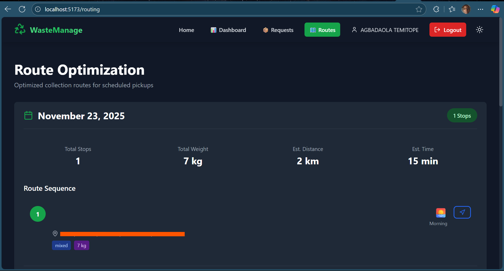

# 🌱 Solid Waste Pickup & Routing System

A comprehensive MERN stack application for managing solid waste pickup requests and optimizing collection routes. This project supports UN Sustainable Development Goals 11 (Sustainable Cities) and 12 (Responsible Consumption & Production).


## 📸 Screenshots

### Admin Interface

*Modern landing page with features showcase*



*Admin dashboard with comprehensive system overview, statistics, and analytics*


*Manage all pickup requests with advanced filtering and status updates*


*Optimized collection routes for efficient waste pickup*

## Project Structure

```
project/
├── backend/                 # Express.js backend server
│   ├── controllers/        # Request handlers
│   ├── models/            # MongoDB schemas
│   ├── routes/            # API routes
│   ├── config/            # Configuration files
│   ├── server.js          # Main server file
│   └── package.json       # Backend dependencies
│
├── frontend/               # React frontend application
│   ├── src/
│   │   ├── components/    # Reusable UI components
│   │   ├── pages/         # Page components
│   │   ├── context/       # React context providers
│   │   ├── hooks/         # Custom React hooks
│   │   ├── utils/         # Utility functions
│   │   ├── App.jsx        # Main App component
│   │   └── main.jsx       # Application entry point
│   ├── public/            # Static assets
│   ├── index.html         # HTML template
│   ├── vite.config.js     # Vite configuration
│   └── package.json       # Frontend dependencies
│
└── README.md              # This file
```

## Features

### Frontend Features
- **User Authentication**: Secure registration and login system with JWT
- **Admin Portal**: Separate admin login for management functions
- **Protected Routes**: Route guards for authenticated users and admins
- **Responsive Design**: Works seamlessly on mobile, tablet, and desktop devices
- **Dark Mode**: Theme switcher with light/dark mode support
- **Pickup Request Management**: Create, view, update, and delete waste pickup requests
- **Real-time Filtering**: Search and filter requests by status, waste type, and date
- **Dashboard**: Visual statistics and insights about waste collection
- **Route Optimization**: Admin view of optimized collection routes
- **Intuitive UI**: Clean, modern interface with smooth animations

### Backend Features
- **JWT Authentication**: Secure token-based authentication for users and admins
- **Password Security**: Bcrypt hashing for all passwords
- **Role-Based Access Control**: Separate permissions for users and admins
- **Single Admin System**: One admin account for security
- **RESTful API**: Well-structured API endpoints for all operations
- **MongoDB Database**: Efficient data storage with Mongoose ODM
- **Request Validation**: Comprehensive input validation and error handling
- **Status Management**: Track pickup requests through multiple states
- **Statistics**: Aggregated data for dashboard insights
- **CORS Support**: Cross-origin resource sharing enabled

## Technology Stack

### Frontend
- **React 18.3** - UI library
- **React Router DOM** - Client-side routing
- **Tailwind CSS** - Utility-first CSS framework
- **Lucide React** - Icon library
- **Vite** - Build tool and development server

### Backend
- **Node.js** - JavaScript runtime
- **Express.js** - Web application framework
- **MongoDB** - NoSQL database
- **Mongoose** - MongoDB object modeling

## Prerequisites

Before running this application, make sure you have:

1. **Node.js** (v16 or higher) installed
2. **MongoDB** installed and running locally on port 27017
3. **npm** or **yarn** package manager

## Installation

### 1. Install Dependencies

Navigate to the root project directory and install all dependencies:

```bash
# Install backend dependencies
cd backend
npm install

# Install frontend dependencies
cd ../frontend
npm install
```

### 2. Configure Environment Variables

**Backend:** Copy `backend/.env.example` to `backend/.env` and update values:
```bash
cp backend/.env.example backend/.env
```

**Frontend:** Copy `frontend/.env.example` to `frontend/.env` and update values:
```bash
cp frontend/.env.example frontend/.env
```

⚠️ **IMPORTANT**: Never commit your `.env` files! They contain sensitive information.

For production deployment, see the deployment documentation for environment variable setup.

### 3. Create Admin Account

Run the one-time admin setup script:

```bash
cd backend
npm run setup-admin
```

Follow the prompts to create your admin account. See `backend/ADMIN_SETUP.md` for details.

**Security Note**: Delete the setup script after creating the admin:
```bash
rm backend/scripts/createAdmin.js  # macOS/Linux
del backend\scripts\createAdmin.js  # Windows
```

### 4. Start MongoDB

Make sure MongoDB is running on your local machine:

```bash
# Start MongoDB service (commands vary by OS)
# On macOS with Homebrew:
brew services start mongodb-community

# On Linux with systemd:
sudo systemctl start mongod

# Or run directly:
mongod
```

## Running the Application

### Start Backend Server

Open a terminal in the backend folder:

```bash
cd backend
npm run dev
```

The backend server will start on `http://localhost:5000`

### Start Frontend Development Server

Open another terminal in the frontend folder:

```bash
cd frontend
npm run dev
```

The frontend application will start on `http://localhost:5173`

### Access the Application

Open your browser and navigate to:
```
http://localhost:5173
```

## API Endpoints

### User Authentication

- `POST /api/users/register` - Register new user account
- `POST /api/users/login` - User login (returns JWT token)
- `GET /api/users/profile` - Get user profile (protected)
- `PUT /api/users/profile` - Update user profile (protected)
- `POST /api/users/change-password` - Change password (protected)

### Admin Authentication

- `POST /api/admin/login` - Admin login (returns JWT token)
- `POST /api/admin/reset-password` - Reset admin password (protected)

### Pickup Requests

- `POST /api/pickup-requests` - Create new request (user protected)
- `GET /api/pickup-requests` - Get all requests (admin protected)
- `GET /api/pickup-requests/:id` - Get single request (admin protected)
- `PUT /api/pickup-requests/:id` - Update request (admin protected)
- `PATCH /api/pickup-requests/:id/status` - Update status (admin protected)
- `DELETE /api/pickup-requests/:id` - Delete request (admin protected)
- `GET /api/pickup-requests/statistics` - Get statistics (admin protected)

### Query Parameters for Filtering

- `status` - Filter by status (pending, scheduled, in-progress, completed, cancelled)
- `wasteType` - Filter by waste type (cartons, plastics, tins, mixed)
- `startDate` - Filter by start date
- `endDate` - Filter by end date

## Component Architecture

### Reusable Components

1. **Button** - Customizable button with variants (primary, secondary, danger, success)
2. **Card** - Content container with optional title and footer
3. **Navbar** - Responsive navigation with mobile menu
4. **Footer** - Site footer with links and copyright
5. **Layout** - Page wrapper that includes Navbar and Footer

### Pages

1. **Home** - Landing page with features and call-to-action
2. **NewRequest** - Form for creating new pickup requests
3. **PickupRequests** - List view with filtering and management
4. **Dashboard** - Statistics and visual insights
5. **Routing** - Optimized collection routes display

### Custom Hooks

- **useLocalStorage** - Persist state in browser localStorage
- **useTheme** - Access theme context (light/dark mode)

## State Management

- **React Context** - Used for theme management
- **Local State** - Component-level state with useState
- **Custom Hooks** - Reusable stateful logic

## Styling Approach

- **Tailwind CSS** - Utility-first approach for rapid development
- **Dark Mode** - Implemented using Tailwind's dark mode class strategy
- **Responsive Design** - Mobile-first approach with responsive utilities
- **Custom Animations** - Smooth transitions and hover effects

## Database Schema

### User Model

```javascript
{
  firstName: String (required),
  lastName: String (required),
  email: String (required, unique),
  password: String (required, hashed),
  phoneNumber: String (required),
  address: {
    street: String,
    city: String,
    state: String,
    zipCode: String
  },
  resetPasswordToken: String,
  resetPasswordExpires: Date,
  role: String (default: 'user'),
  createdAt: Date,
  updatedAt: Date
}
```

### Admin Model

```javascript
{
  name: String (required),
  email: String (required, unique),
  password: String (required, hashed),
  role: String (default: 'admin'),
  isActive: Boolean (default: true),
  lastLogin: Date,
  createdAt: Date,
  updatedAt: Date
}
```

### PickupRequest Model

```javascript
{
  userName: String (required),
  userEmail: String (required),
  userPhone: String (required),
  address: String (required),
  coordinates: {
    latitude: Number,
    longitude: Number
  },
  wasteType: [String] (enum: cartons, plastics, tins, mixed),
  estimatedWeight: Number (required, min: 1),
  description: String (max: 500 characters),
  preferredDate: Date (required),
  preferredTimeSlot: String (enum: morning, afternoon, evening),
  status: String (enum: pending, scheduled, in-progress, completed, cancelled),
  routeId: String,
  priority: Number (1-5),
  createdAt: Date,
  updatedAt: Date,
  completedAt: Date
}
```

## Building for Production

### Frontend

```bash
cd frontend
npm run build
```

The production build will be created in `frontend/dist/`

### Backend

The backend is production-ready. Make sure to:
1. Set proper environment variables
2. Use a production MongoDB instance
3. Enable security best practices

## Future Enhancements

- User authentication and authorization
- Real-time notifications
- Integration with mapping APIs (Google Maps, Mapbox)
- Mobile application
- Payment integration
- Advanced analytics and reporting
- Driver mobile app
- SMS/Email notifications
- QR code for pickup verification

## Contributing

1. Fork the repository
2. Create a feature branch
3. Make your changes
4. Test thoroughly
5. Submit a pull request

## License

This project is open-source and available under the MIT License.

## Support

For issues, questions, or contributions, please contact the development team.

---

**Built with ❤️ for a sustainable future**

Supporting UN SDG 11 (Sustainable Cities) and SDG 12 (Responsible Consumption & Production)
